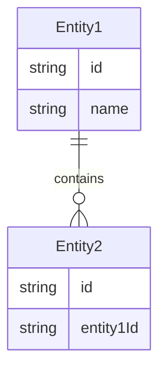
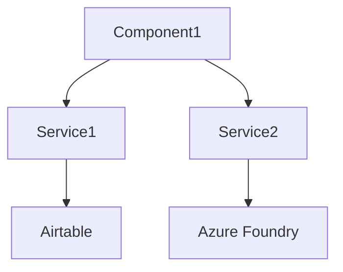
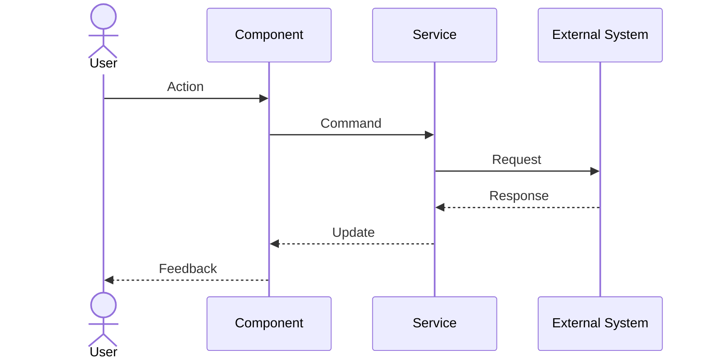

# Phased Documentation Generation System

This document defines a **6-phase approach** to generating complete plugin documentation, with validation gates between each phase.

---

## Overview

Instead of generating all 43 core files at once, we break the work into:

**Preflight Phase**: Pre-Flight Validation (blocking)  
**Phase 1**: Foundation (root + indices)  
**Phase 2**: Base Layer (conceptual truth)  
**Phase 3**: Architecture Layer (implementation)  
**Phase 4**: UI & Appendix (user-facing + project-specific)  
**Phase 5**: Diagrams & Cross-Validation

Each phase produces **complete, reviewable outputs** before proceeding.

---

## Execution Modes

The system supports two mode dimensions:

### Review Mode
- **interactive** (default): Stops after each phase for user review
- **batch**: Generates all phases sequentially without blocking

### Validation Strictness
- **strict** (default): Full enforcement of all validation rules
- **lenient**: Relaxed enforcement for early-stage ideation

**Mode Selection**: Set in generation config:
```json
{
  "review_mode": "interactive" | "batch",
  "validation_strictness": "strict" | "lenient"
}
```

---

## Validation Strictness Rules

### Strict Mode (default)
All validation rules are enforced as specified. This is the production-ready mode.

**Use when**:
- Generating final documentation
- Preparing for implementation
- Publishing documentation
- Requirements are well-defined

### Lenient Mode
Relaxes certain validation rules to enable earlier iteration while maintaining core guarantees.

**Relaxed rules**:
- Performance targets optional (warnings instead of errors)
- Diagram file (`-43-diagrams.md`) optional
- Completeness threshold lowered from 95% to 85%
- Missing integration failure policies generate warnings
- Missing audit configuration generates warnings

**Still enforced (non-negotiable)**:
- ✅ No placeholders (`{...}`, `TODO`, `TBD`)
- ✅ No broken links
- ✅ Terminology consistency
- ✅ Schema consistency
- ✅ All entities must have schemas
- ✅ All flows must be documented
- ✅ Source-of-truth precedence

**Use when**:
- Early plugin ideation
- Prototyping
- Requirements still evolving
- Exploring feasibility

**Upgrade path**: Start lenient, switch to strict before implementation.

---

## Execution Modes (Legacy - keep for backward compat)

The system supports two modes:

### Interactive Mode (default)
- Stops after each phase for user review
- Requires explicit approval to proceed
- Best for: new plugins, complex domains, uncertain requirements

### Batch Mode
- Generates all phases sequentially
- Emits validation reports but doesn't block
- Best for: well-defined plugins, automated pipelines, regeneration

**Mode Selection**: Set `review_mode: "interactive" | "batch"` in generation config.

---

## Source-of-Truth Precedence

When inputs conflict, the LLM must follow this hierarchy:

1. **`plugin-requirements.json`** (highest authority)
2. **Host architecture docs** (runtime/hosting constraints)
3. **Reference docset zip** (structural conventions)
4. **Natural language brief** (lowest authority)

**Rule**: JSON overrides prose. Always.

---

## Global Content Rules

These rules apply to **every file in every phase**:

### Placeholder Ban
The following strings are **forbidden** in final outputs:
- `{Concept1}`, `{EntityName}`, `{PluginName}` (unless in examples/templates)
- `TODO`, `TBD`, `FIXME`, `???`, `[placeholder]`
- `<insert X here>`, `// to be determined`

**Enforcement**: Each phase validation gate must check for these strings.

### Link Integrity
- All internal links must resolve to files in the planned file list
- Use relative paths only: `({slug}-XX-file.md)` or `({slug}-XX-file.md#anchor)`
- No external links without explicit approval

### Terminology Consistency
- All terms must match `02-terminology-index.json` (generated in Phase 2)
- Once a term is defined, it cannot be redefined
- Acronyms must be defined on first use per file

---

## File Counting & Terminology

### Core Documentation Files: 43
**Definition**: The numbered `.md` files that constitute the plugin documentation deliverable.

These files are:

```
{slug}.md                           # 1 root file
{slug}-00-base-index.md             # 1 index
{slug}-01 through -11               # 11 Base files
{slug}-12-arch-index.md             # 1 index
{slug}-13 through -25               # 13 Architecture files
{slug}-26-ui-index.md               # 1 index
{slug}-27 through -38               # 12 UI files
{slug}-39-appendix-index.md         # 1 index
{slug}-40 through -42               # 3 Appendix files
{slug}-43-diagrams.md               # 1 diagram file
---
Total: 43 Core Documentation Files
```

### Generation Artifacts (meta/support files)
**Definition**: Files produced during generation for validation, tracking, and quality assurance. These are NOT included in the deliverable bundle.

These files are:

```
00-preflight-summary.md (or 00-preflight-questions.md)
01-planned-files.json
01-phase1-validation.md
02-terminology-index.json
02-phase2-validation.md
03-phase3-validation.md
04-phase4-validation.md
05-final-validation-report.md
```

**Deliverable**: 43 Core Documentation Files (in `{slug}-documentation-bundle.zip`)  
**Artifacts**: 8+ Generation Artifacts (for validation/review, NOT in bundle)

---

## Preflight Phase: Pre-Flight Validation

### Purpose
Verify that all required inputs exist before any generation begins.

### Inputs Required
- `plugin-requirements.json`
- Host structure reference (zip, tree, or inline)
- Documentation formula
- At least one example docset (e.g., node-editor.zip)

### Validation Checklist

```markdown
## Blocking Requirements

### Plugin Identity
- [ ] `plugin.name` is defined
- [ ] `plugin.slug` is defined (lowercase, hyphenated)
- [ ] `plugin.summary` exists (50-500 chars)

### Core Domain
- [ ] At least 1 entity defined in `entities[]`
- [ ] Each entity has:
  - [ ] `name`
  - [ ] `id_strategy`
  - [ ] At least 3 fields (including `id`)
- [ ] At least 1 primary flow defined in `users_and_flows.primary_flows[]`

### Host Integration
- [ ] `host_integration_contract.runtime.ui_framework` is defined
- [ ] `host_integration_contract.runtime.blazor_model` is defined
- [ ] `host_integration_contract.plugin_structure_reference` exists

### Technical Constraints
- [ ] At least 1 validation rule per entity OR explicit statement of "no validation"
- [ ] Permissions model defined (`rbac`, `abac`, or `custom`)

## Warning Requirements (proceed with caution)

### Strict Mode
- [ ] No performance targets defined → **ERROR: blocks generation**
- [ ] No integration failure policies defined → **ERROR: blocks generation**
- [ ] No audit configuration defined → **ERROR: blocks generation**

### Lenient Mode
- [ ] No performance targets defined → **WARNING: generation continues**
- [ ] No integration failure policies defined → **WARNING: generation continues**
- [ ] No audit configuration defined → **WARNING: generation continues**

## Output

If ANY blocking requirement fails:
- Generate `00-preflight-questions.md` with specific questions
- STOP generation (both strict and lenient modes)
- Wait for user to provide answers

If all blocking requirements pass:
- Generate `00-preflight-summary.md` with:
  - Confirmed inputs
  - Warnings (if any, differentiated by strictness mode)
  - Proposed file list
  - Active validation strictness mode
- In interactive mode: Request user approval to proceed to Phase 1
- In batch mode: Proceed automatically to Phase 1
```

### Deliverable
- `00-preflight-summary.md` (if passing)
- `00-preflight-questions.md` (if failing)

---

## Phase 1: Foundation

### Purpose
Generate the structural skeleton that all other phases depend on.

### Pre-Phase 1: Generate Planned File List

**Before generating any markdown**, create:

```json
// 01-planned-files.json
{
  "version": "1.0",
  "slug": "{pluginSlug}",
  "core_files": [
    "{slug}.md",
    "{slug}-00-base-index.md",
    "{slug}-01-base-vision.md",
    "{slug}-02-base-concepts.md",
    // ... all 43 files listed explicitly
  ],
  "optional_files": [
    "{slug}-03-base-models.md"  // if not node-based
  ],
  "excluded_files": [
    "{slug}-03-base-basenodes.md"  // if not node-based
  ],
  "notes": {
    "base_layer_adaptation": "If plugin doesn't implement node graphs, files -03 through -08 use domain equivalents but keep numbering"
  }
}
```

**Rule**: All links in all phases must only reference files in `core_files[]` or `optional_files[]`.

### Files Generated

```
{slug}.md                    # Root entrypoint
{slug}-00-base-index.md      # Base layer index
{slug}-12-arch-index.md      # Architecture layer index
{slug}-26-ui-index.md        # UI layer index
{slug}-39-appendix-index.md  # Appendix layer index
```

### Content Rules

#### `{slug}.md` (Root File)
Must contain:
1. **H1**: Plugin name
2. **Purpose** (2-3 paragraphs from `plugin.summary`)
3. **Glossary** (5-10 key terms)
4. **Tech Split** (table: what's in Base vs Arch vs UI)
5. **Guiding Principle** (1-2 sentences)
6. **Scope Definition** (what's in scope)
7. **Non-Goals** (what's out of scope)
8. **Success Criteria** (3-5 measurable outcomes)
9. **Documentation Index** (links to 5 index files)

#### Index Files (`{slug}-XX-index.md`)
Each index file must contain:
1. **H1**: Layer name (e.g., "Base Layer", "Architecture Layer")
2. **Purpose** (2-3 sentences: what this layer covers)
3. **File List** (bulleted list of links with 1-line descriptions)
4. **Backlink** to `{slug}.md`
5. **Global Navigation** (Base | Arch | UI | Appendix | Diagrams)

**Critical Link Rule**: Index files must ONLY link to files that exist in `01-planned-files.json`. No exceptions.

### Validation Gate

```markdown
## Phase 1 Validation Checklist

### File Existence
- [ ] All 6 files generated
- [ ] Filenames match exactly (case-sensitive)

### Link Integrity
- [ ] All links reference files in `01-planned-files.json`
- [ ] No broken links
- [ ] No links to excluded files

### Content Completeness
- [ ] No placeholder strings (`{...}`, `TODO`, etc.)
- [ ] All required sections present in root file
- [ ] All index files follow template structure

### Terminology
- [ ] Consistent terminology across all 6 files
- [ ] Key terms listed in root glossary

## Output
- If passing: 
  - Generate `01-phase1-validation.md`
  - Interactive mode: Request approval
  - Batch mode: Proceed to Phase 2
- If failing: 
  - Generate `01-phase1-issues.md` 
  - STOP (both modes)
```

### Deliverable
- `01-planned-files.json`
- 6 complete Markdown files
- `01-phase1-validation.md` (summary)

---

## Phase 2: Base Layer

### Purpose
Generate conceptual, framework-agnostic documentation.

### Domain Adaptation Rule

**For node-based plugins** (like node-editor):
Use files as specified: `-03-base-basenodes.md`, `-04-base-nodetypes.md`, etc.

**For non-node plugins**:
Replace domain-specific files with equivalents while **keeping the same numbering**:

| Original (Node Editor) | Replacement Example | Number |
|------------------------|---------------------|--------|
| `-03-base-basenodes.md` | `-03-base-models.md` | 03 |
| `-04-base-nodetypes.md` | `-04-base-entity-types.md` | 04 |
| `-05-base-structure-generator.md` | `-05-base-builders.md` | 05 |
| `-07-base-flow-type.md` | `-07-base-lifecycle.md` | 07 |

**Update `01-planned-files.json`** to reflect these substitutions.

### Files Generated (11 files)

```
{slug}-01-base-vision.md
{slug}-02-base-concepts.md
{slug}-03-base-{domain}.md         # adapted per plugin type
{slug}-04-base-{domain}.md         # adapted per plugin type
{slug}-05-base-{domain}.md         # adapted per plugin type
{slug}-06-base-execution.md
{slug}-07-base-{domain}.md         # adapted per plugin type
{slug}-08-base-foundry-airtable.md # or integrations.md
{slug}-09-base-examples.md
{slug}-10-base-sync.md
{slug}-11-base-schema.md
```

### Content Templates

#### `{slug}-01-base-vision.md`
```markdown
# Vision

[2-3 paragraphs: Why this plugin exists, what problem it solves]

## Design Philosophy

[3-5 principles that guide all design decisions]

## Key Differentiators

[What makes this plugin different from alternatives]

---
← [Back to Base Index]({slug}-00-base-index.md)

**Navigation**: [Base]({slug}-00-base-index.md) | [Architecture]({slug}-12-arch-index.md) | [UI]({slug}-26-ui-index.md) | [Appendix]({slug}-39-appendix-index.md) | [Diagrams]({slug}-43-diagrams.md)
```

#### `{slug}-02-base-concepts.md`
```markdown
# Concepts

[1-2 paragraphs: Overview of core concepts]

## Core Concepts

### {Concept1}
**Definition**: [Precise, unambiguous definition]

**Properties**:
- Property A: [description]
- Property B: [description]

**Example**:
```json
{
  "exampleField": "exampleValue"
}
```

**Relates to**: [{Concept2}]({slug}-02-base-concepts.md#concept2)

[Repeat for 5-10 concepts]

---
← [Back to Base Index]({slug}-00-base-index.md)

**Navigation**: [Base]({slug}-00-base-index.md) | [Architecture]({slug}-12-arch-index.md) | [UI]({slug}-26-ui-index.md) | [Appendix]({slug}-39-appendix-index.md) | [Diagrams]({slug}-43-diagrams.md)
```

#### `{slug}-11-base-schema.md`
```markdown
# Canonical Schema

[1-2 paragraphs: Purpose of this schema definition]

## Entities

### {EntityName}

**Purpose**: [What this entity represents]

**ID Strategy**: `{id_strategy.type}`

**Lifecycle**: {lifecycle.states as comma-separated list}

**Schema**:

```json
{
  "id": "string (required)",
  "version": "number (required)",
  "fieldName": "type (required/optional)",
  "anotherField": "type (required/optional)"
}
```

**Field Definitions**:

| Field | Type | Required | Validation | Example |
|-------|------|----------|------------|---------|
| id | string | ✅ | non-empty | `"01JABCD..."` |
| fieldName | string | ✅ | 1-200 chars | `"Example"` |

**Invariants**:
- [Invariant 1]
- [Invariant 2]

[Repeat for all entities]

---
← [Back to Base Index]({slug}-00-base-index.md)

**Navigation**: [Base]({slug}-00-base-index.md) | [Architecture]({slug}-12-arch-index.md) | [UI]({slug}-26-ui-index.md) | [Appendix]({slug}-39-appendix-index.md) | [Diagrams]({slug}-43-diagrams.md)
```

### Generation Order
1. `{slug}-02-base-concepts.md` (defines terminology)
2. `{slug}-11-base-schema.md` (defines data structures)
3. Generate `02-terminology-index.json` (canonical term list)
4. `{slug}-01-base-vision.md` (uses terminology)
5. `{slug}-03` through `{slug}-10` (reference both)

### Canonical Terminology Artifact

After generating `-02-base-concepts.md`, extract:

```json
// 02-terminology-index.json
{
  "version": "1.0",
  "slug": "{pluginSlug}",
  "terms": [
    {
      "term": "Entity",
      "definition": "A domain object with identity and lifecycle",
      "defined_in": "{slug}-02-base-concepts.md#entity",
      "synonyms": [],
      "related_terms": ["Schema", "Lifecycle"]
    },
    {
      "term": "Flow",
      "definition": "A sequence of user actions leading to an outcome",
      "defined_in": "{slug}-02-base-concepts.md#flow",
      "synonyms": ["User Flow", "Workflow"],
      "related_terms": ["Command", "Event"]
    }
  ],
  "forbidden_terms": [
    {
      "term": "Record",
      "use_instead": "Entity",
      "reason": "Avoids confusion with database records"
    }
  ]
}
```

**Rule**: All subsequent phases must use terms from this artifact exactly as defined.

### Validation Gate

```markdown
## Phase 2 Validation Checklist

### File Generation
- [ ] All 11 files generated
- [ ] Domain-adapted filenames match `01-planned-files.json`

### Terminology Consistency
- [ ] `02-terminology-index.json` generated
- [ ] All terms from `-02-base-concepts.md` are in the index
- [ ] Each term is used consistently across all 11 files
- [ ] No undefined terms used
- [ ] No forbidden terms used

### Schema Completeness
- [ ] Every entity from `plugin-requirements.json` has a schema definition
- [ ] Every field has: type, required flag, validation, example
- [ ] All invariants from JSON are documented

### Cross-References
- [ ] All internal links resolve to files in `01-planned-files.json`
- [ ] All "Relates to" links point to real sections
- [ ] No broken anchors

### Placeholder Check
- [ ] No `{...}` placeholders remain
- [ ] No `TODO` or `TBD` strings
- [ ] All code examples are syntactically valid and consistent with documented APIs

## Output
- If passing:
  - Generate `02-phase2-validation.md`
  - Interactive mode: Request approval
  - Batch mode: Proceed to Phase 3
- If failing:
  - Generate `02-phase2-issues.md`
  - STOP (both modes)
```

### Deliverable
- 11 complete Markdown files
- `02-terminology-index.json`
- `02-phase2-validation.md`

---

## Phase 3: Architecture Layer

### Purpose
Document how the plugin is built and integrated.

### Files Generated (13 files)

```
{slug}-13-arch.md
{slug}-14-arch-blazor.md
{slug}-15-arch-data.md
{slug}-16-arch-json.md
{slug}-17-arch-js.md
{slug}-18-arch-visual.md
{slug}-19-arch-updates.md
{slug}-20-arch-macro.md
{slug}-21-arch-validation.md
{slug}-22-arch-performance.md
{slug}-23-arch-testing.md
{slug}-24-arch-deployment.md
{slug}-25-arch-resources.md
```

### Critical Dependencies
- Must reference Base Layer terminology (use `02-terminology-index.json`)
- Must use schemas from `{slug}-11-base-schema.md`
- Must not introduce new entities (only implementation details)
- Must respect source-of-truth precedence (JSON > prose)

### Content Templates

#### `{slug}-13-arch.md`
```markdown
# Architecture Overview

[2-3 paragraphs: High-level architecture description]

## Boundaries

### Plugin Boundary
- **Owns**: [List of components/services this plugin owns]
- **Depends on**: [Modules and host services]
- **Does NOT depend on**: [Other plugins]

### Module Dependencies

| Module | Purpose | Required Operations |
|--------|---------|---------------------|
| ModuleA | [purpose] | [operations used] |

## Component Diagram

[Mermaid or reference to {slug}-43-diagrams.md]

---
← [Back to Architecture Index]({slug}-12-arch-index.md)

**Navigation**: [Base]({slug}-00-base-index.md) | [Architecture]({slug}-12-arch-index.md) | [UI]({slug}-26-ui-index.md) | [Appendix]({slug}-39-appendix-index.md) | [Diagrams]({slug}-43-diagrams.md)
```

#### `{slug}-21-arch-validation.md`
```markdown
# Validation Rules

[1-2 paragraphs: Validation philosophy]

## Entity Validation

### {EntityName}

**Structural Rules**:
- Rule 1: [description + violation message]
- Rule 2: [description + violation message]

**Business Rules**:
- Rule 1: [description + violation message]

**Example Valid Instance**:
```json
{
  "id": "01JABCD...",
  "field": "valid value"
}
```

**Example Invalid Instances**:

```json
// Violation: [specific rule]
{
  "id": "",
  "field": "value"
}
// Error: "ID cannot be empty"
```

[Repeat for all entities]

## Runtime Validation

**When validation occurs**:
- On entity creation
- On entity update
- Before save/sync
- [Other triggers]

**Validation response**:
- Blocking errors: [list]
- Warnings: [list]
- Ignored: [list]

---
← [Back to Architecture Index]({slug}-12-arch-index.md)

**Navigation**: [Base]({slug}-00-base-index.md) | [Architecture]({slug}-12-arch-index.md) | [UI]({slug}-26-ui-index.md) | [Appendix]({slug}-39-appendix-index.md) | [Diagrams]({slug}-43-diagrams.md)
```

### Validation Gate

```markdown
## Phase 3 Validation Checklist

### File Generation
- [ ] All 13 files generated
- [ ] All filenames match `01-planned-files.json`

### Terminology Consistency
- [ ] All terms match `02-terminology-index.json` exactly
- [ ] No new conceptual terms introduced (only implementation terms)
- [ ] No forbidden terms used

### Schema Consistency
- [ ] All entities reference schemas from `-11-base-schema.md`
- [ ] No schema redefinition or divergence
- [ ] All field types match Base layer

### Host Integration
- [ ] Blazor model from JSON is documented in `-14-arch-blazor.md`
- [ ] All integrations from JSON appear in appropriate arch files
- [ ] Failure policies match JSON exactly

### Dependency Rules
- [ ] No plugin-to-plugin dependencies documented
- [ ] All module dependencies are documented
- [ ] No circular dependencies
- [ ] Module/Plugin separation enforced

### Placeholder Check
- [ ] No `{...}` placeholders remain
- [ ] No `TODO` or `TBD` strings
- [ ] All code examples are syntactically valid and consistent with documented APIs

## Output
- If passing:
  - Generate `03-phase3-validation.md`
  - Interactive mode: Request approval
  - Batch mode: Proceed to Phase 4
- If failing:
  - Generate `03-phase3-issues.md`
  - STOP (both modes)
```

### Deliverable
- 13 complete Markdown files
- `03-phase3-validation.md`

---

## Phase 4: UI & Appendix

### Purpose
Document user-facing behavior and project-specific implementation.

### Files Generated (16 files)

#### UI Layer (12 files)
```
{slug}-27-ui-spec.md
{slug}-28-ui-uxd.md
{slug}-29-ui-design.md
{slug}-30-ui-layout.md
{slug}-31-ui-navigation.md
{slug}-32-ui-components.md
{slug}-33-ui-interactions.md
{slug}-34-ui-motion.md
{slug}-35-ui-validation.md
{slug}-36-ui-sync.md
{slug}-37-ui-accessibility.md
{slug}-38-ui-examples.md
```

#### Appendix Layer (4 files)
```
{slug}-40-appendix-ui.md
{slug}-41-appendix-plugin-structure.md
{slug}-42-appendix-task-reference.md
```

### Content Templates

#### `{slug}-27-ui-spec.md`
```markdown
# UI Specification

[2-3 paragraphs: UI goals and constraints]

## Design Goals

1. **Goal 1**: [description + rationale]
2. **Goal 2**: [description + rationale]

## Constraints

- **Performance**: [from `-22-arch-performance.md`]
- **Accessibility**: [WCAG level, assistive tech support]
- **Browser Support**: [list]
- **Responsive**: [breakpoints if applicable]

## UI Architecture Pattern

[Component hierarchy, state management approach]

---
← [Back to UI Index]({slug}-26-ui-index.md)

**Navigation**: [Base]({slug}-00-base-index.md) | [Architecture]({slug}-12-arch-index.md) | [UI]({slug}-26-ui-index.md) | [Appendix]({slug}-39-appendix-index.md) | [Diagrams]({slug}-43-diagrams.md)
```

#### `{slug}-35-ui-validation.md`
```markdown
# UI Validation & Error Handling

[1-2 paragraphs: How errors appear to users]

## Validation UX

### Inline Validation
- **When**: [on blur, on change, on submit]
- **Style**: [error message placement, color, icon]
- **Example**: [screenshot reference or description]

### Error Summary
- **When shown**: [on form submit, on save]
- **Content**: [list of all errors, links to fields]

## Error States

### {ErrorCode}
- **User Message**: "{user-facing message from JSON}"
- **Visual Treatment**: [color, icon, position]
- **Recovery Action**: [what user should do from JSON]
- **Example**:

```
[Visual mockup or description]
```

[Repeat for all error codes from `plugin-requirements.json`]

## Validation Timing

| Event | Validation Performed | UX Response |
|-------|---------------------|-------------|
| Field blur | Field-level rules | Inline error/success |
| Form submit | All rules | Error summary + block submit |
| Auto-save | Critical rules only | Silent or toast |

---
← [Back to UI Index]({slug}-26-ui-index.md)

**Navigation**: [Base]({slug}-00-base-index.md) | [Architecture]({slug}-12-arch-index.md) | [UI]({slug}-26-ui-index.md) | [Appendix]({slug}-39-appendix-index.md) | [Diagrams]({slug}-43-diagrams.md)
```

#### `{slug}-41-appendix-plugin-structure.md`
```markdown
# Plugin Folder Structure

[1-2 paragraphs: How this plugin's files map to host folders]

## Host Plugin Root

```
{host_integration_contract.plugin_structure_reference.value}
└── {PluginName}/
├── Components/
│   ├── {Component1}.razor
│   └── {Component2}.razor
├── Services/
│   ├── {Service1}.cs
│   └── {Service2}.cs
├── Models/
│   ├── {Entity1}.cs
│   └── {Entity2}.cs
└── wwwroot/
└── js/
└── {plugin-slug}.js
```

## File Responsibilities

### Components/
- **{Component1}.razor**: [purpose, references to UI docs]
- **{Component2}.razor**: [purpose]

### Services/
- **{Service1}.cs**: [purpose, DI lifetime, references to arch docs]
- **{Service2}.cs**: [purpose]

### Models/
- **{Entity1}.cs**: [maps to schema in `-11-base-schema.md`]

### wwwroot/js/
- **{plugin-slug}.js**: [JS interop responsibilities from `-17-arch-js.md`]

## Cross-Reference to Documentation

| File | Primary Documentation |
|------|----------------------|
| {Component1}.razor | [{slug}-32-ui-components.md]({slug}-32-ui-components.md#component1) |
| {Service1}.cs | [{slug}-15-arch-data.md]({slug}-15-arch-data.md#service1) |
| {Entity1}.cs | [{slug}-11-base-schema.md]({slug}-11-base-schema.md#entity1) |

---
← [Back to Appendix Index]({slug}-39-appendix-index.md)

**Navigation**: [Base]({slug}-00-base-index.md) | [Architecture]({slug}-12-arch-index.md) | [UI]({slug}-26-ui-index.md) | [Appendix]({slug}-39-appendix-index.md) | [Diagrams]({slug}-43-diagrams.md)
```

### Validation Gate

```markdown
## Phase 4 Validation Checklist

### File Generation
- [ ] All 16 files generated
- [ ] All filenames match `01-planned-files.json`

### UI-Architecture Consistency
- [ ] All validation rules in `-35-ui-validation.md` match `-21-arch-validation.md`
- [ ] All error codes from JSON appear in `-35-ui-validation.md`
- [ ] All error messages match JSON exactly (no paraphrasing)
- [ ] All components reference schemas from Base layer
- [ ] Performance constraints from `-22-arch-performance.md` appear in `-27-ui-spec.md`

### Appendix Completeness
- [ ] All entities from Base schema appear in `-41-appendix-plugin-structure.md`
- [ ] All components from UI layer appear in structure mapping
- [ ] All services from Architecture layer appear in structure mapping
- [ ] All files have cross-references to their documentation

### Terminology Consistency
- [ ] All terms match `02-terminology-index.json`
- [ ] No new terms introduced without updating index

### Placeholder Check
- [ ] No `{...}` placeholders remain
- [ ] No `TODO` or `TBD` strings
- [ ] All code examples are syntactically valid and consistent with documented APIs

## Output
- If passing:
  - Generate `04-phase4-validation.md`
  - Interactive mode: Request approval
  - Batch mode: Proceed to Phase 5
- If failing:
  - Generate `04-phase4-issues.md`
  - STOP (both modes)
```

### Deliverable
- 16 complete Markdown files
- `04-phase4-validation.md`

---

## Phase 5: Diagrams & Final Validation

### Purpose
Add visual documentation and perform final consistency checks.

### Files Generated (1 file + validation report)

**Note**: In **lenient mode**, the diagrams file is optional. If skipped, update `01-planned-files.json` to exclude it and update all navigation blocks to remove the Diagrams link.

```
{slug}-43-diagrams.md  (optional in lenient mode)
```

### Content Template

#### `{slug}-43-diagrams.md`
```markdown
# Diagrams

This page contains all architectural and flow diagrams for the {PluginName} plugin.

---

## Entity Relationships

**Purpose**: Shows how entities relate to each other



**References**:
- [Entity1 Schema]({slug}-11-base-schema.md#entity1)
- [Entity2 Schema]({slug}-11-base-schema.md#entity2)

---

## Component Architecture

**Purpose**: Shows how components and services interact



**References**:
- [Architecture Overview]({slug}-13-arch.md)
- [Component Catalog]({slug}-32-ui-components.md)

---

## Primary Flow: {Flow1 Name}

**Purpose**: {Flow1 purpose from plugin-requirements.json}



**References**:
- [User Flow Definition]({slug}.md#flow1)
- [Execution Model]({slug}-06-base-execution.md)

---

[Repeat for all major flows and architectural views]

---

## Diagram Legend

### Node Types
- **Rectangle**: Component or Service
- **Cylinder**: Data store
- **Cloud**: External system
- **Actor**: User role

### Edge Types
- **Solid arrow**: Synchronous call
- **Dashed arrow**: Asynchronous/event
- **Thick arrow**: Data flow

---
← [Back to Root]({slug}.md)

**Navigation**: [Base]({slug}-00-base-index.md) | [Architecture]({slug}-12-arch-index.md) | [UI]({slug}-26-ui-index.md) | [Appendix]({slug}-39-appendix-index.md) | [Diagrams]({slug}-43-diagrams.md)
```

### Final Validation

```markdown
## Phase 5 Final Validation Checklist

### File Count Verification
- [ ] Total files generated: 43 core documentation files
- [ ] All files in `01-planned-files.json` exist
- [ ] No extra files generated
- [ ] No missing files

### Link Integrity
- [ ] Run automated link checker across all 43 files
- [ ] Verify all internal links resolve
- [ ] Verify all anchor links point to real headings
- [ ] No broken references
- [ ] All links in diagrams resolve

### Terminology Consistency
- [ ] All terms match `02-terminology-index.json`
- [ ] No term is defined differently in different files
- [ ] All acronyms defined on first use per file
- [ ] No forbidden terms used

### Schema Consistency
- [ ] Every entity appears in:
  - [ ] `-11-base-schema.md`
  - [ ] `-16-arch-json.md` (if persisted)
  - [ ] `-41-appendix-plugin-structure.md` (if has C# model)
- [ ] No schema divergence across files
- [ ] All field types consistent
- [ ] All validation rules consistent

### Validation Consistency
- [ ] Every validation rule in `-21-arch-validation.md` has:
  - [ ] User message in `-35-ui-validation.md`
  - [ ] Error code in `plugin-requirements.json`
- [ ] No orphaned error codes
- [ ] All error messages match JSON exactly

### Flow Completeness
- [ ] Every flow in `plugin-requirements.json` has:
  - [ ] Diagram in `-43-diagrams.md`
  - [ ] Example in `-09-base-examples.md` or `-38-ui-examples.md`
  - [ ] Architectural coverage in appropriate arch files
  - [ ] User documentation in UI layer

### Integration Coverage
- [ ] Every integration in `plugin-requirements.json` appears in:
  - [ ] `-08-base-foundry-airtable.md` (or integrations.md)
  - [ ] Appropriate arch file (implementation)
  - [ ] `-25-arch-resources.md` (if has external docs)
- [ ] All failure policies documented
- [ ] All auth methods documented

### Permission Coverage
- [ ] Every role in `plugin-requirements.json` appears in:
  - [ ] Root file or concepts
  - [ ] Architecture layer (implementation)
  - [ ] UI layer (if affects UI)
- [ ] All sensitive data handling documented

### Placeholder Check (Global)
- [ ] No `{...}` placeholders in any Core Documentation File
- [ ] No `TODO`, `TBD`, `FIXME`, `???` strings
- [ ] No `<insert X here>` patterns
- [ ] All code examples are syntactically valid and consistent with documented APIs
- [ ] All file paths are concrete (no generic placeholders)

### Completeness Score

**Calculation**:
```
Total requirements from JSON: {count}
Documented requirements: {count}
Coverage: {percentage}%

Required minimum:
- Strict mode: 95%
- Lenient mode: 85%
```

**Breakdown by category**:
- Entities: {X/Y} (Z%)
- Flows: {X/Y} (Z%)
- Integrations: {X/Y} (Z%)
- Permissions: {X/Y} (Z%)
- Validation rules: {X/Y} (Z%)
- Error codes: {X/Y} (Z%)

## Output

### If passing (≥threshold coverage, no broken links, no placeholders):

**Threshold**:
- Strict mode: ≥95%
- Lenient mode: ≥85%

**Actions**:
- Generate `05-final-validation-report.md` with:
  - Completeness score
  - Link integrity report
  - Terminology consistency report
  - Schema consistency report
  - Active validation strictness mode
  - List of all 43 Core Documentation Files with sizes (or 42 if diagrams excluded in lenient mode)
- Generate `{slug}-documentation-bundle.zip` containing:
  - All Core Documentation Files (43 in strict mode, potentially 42 in lenient if diagrams skipped)
  - `README.md` (points to `{slug}.md` as entry point)
- Mark as **COMPLETE**
- Output success message with download link

### If failing (<threshold coverage OR broken links OR placeholders):

**Threshold**:
- Strict mode: <95%
- Lenient mode: <85%

**Actions**:
- Generate `05-final-issues.md` with:
  - Detailed list of broken links (file + line number)
  - List of missing requirements (category + specific item)
  - List of inconsistencies (files involved + nature of conflict)
  - List of remaining placeholders (file + line number)
  - Recommended fixes
- DO NOT generate bundle.zip
- DO NOT mark as complete
- Interactive mode: Request user to fix issues
- Batch mode: Exit with error code
```

### Deliverable
- `{slug}-43-diagrams.md`
- `05-final-validation-report.md` (if passing)
- `05-final-issues.md` (if failing)
- `{slug}-documentation-bundle.zip` (if passing)

---

## Regeneration Policy

### No Silent Regeneration Rule

**Critical Rule**: If a phase fails validation, previously generated Core Documentation Files **MUST NOT** be silently regenerated unless explicitly instructed by the user.

**Rationale**: Silent regeneration causes:
- Terminology drift between phases
- Loss of approved content
- Confusion about what changed
- Validation instability

**Enforcement**:
1. When a phase fails validation, the system MUST:
  - Generate an issues report
  - STOP generation
  - Wait for explicit user action

2. User has three options:
  - **Fix inputs**: Update `plugin-requirements.json` or provide missing info, then regenerate failed phase only
  - **Manual edit**: Edit the failing Core Documentation Files directly, then re-run validation
  - **Full regeneration**: Explicitly request regeneration of all phases from scratch

3. Partial regeneration (regenerating only failed phases):
  - Load `02-terminology-index.json` from successful Phase 2
  - Reference existing Core Documentation Files from successful phases
  - Generate only the files that failed validation
  - Re-run final validation

**Example**:
```
Phase 3 fails validation due to broken links.
✅ CORRECT: Stop, report issues, wait for user to fix Phase 3 files
❌ WRONG: Silently regenerate Phase 1 and 2 to "fix" the problem
```

### Versioning of Generation Artifacts

When regenerating, preserve previous Generation Artifacts:

```
02-phase2-validation.md          # Current version
02-phase2-validation-v1.md       # Previous version
02-phase2-validation-v2.md       # Version before that
```

This allows comparison and rollback if needed.

---

## Usage Instructions

### For the LLM

When asked to generate plugin documentation:

#### 1. **Preflight Phase**
```
1. Request `plugin-requirements.json` and validation_strictness setting
2. Run pre-flight validation checklist (adjusted for strictness mode)
3. If ANY blocking requirement fails:
   - Output ONLY `00-preflight-questions.md`
   - List specific missing items
   - DO NOT proceed
4. If all blocking requirements pass:
   - Output `00-preflight-summary.md`
   - List confirmed inputs
   - List warnings
   - Request approval (interactive) or proceed (batch)
```

#### 2. **Phase 1: Foundation**
```
1. Generate `01-planned-files.json` first
2. Generate 6 foundation files
3. Verify all links point to files in planned list
4. Run Phase 1 validation checklist
5. Request approval (interactive) or proceed (batch)
```

#### 3. **Phase 2: Base Layer**
```
1. Check if plugin is node-based or needs domain adaptation
2. Update `01-planned-files.json` if needed
3. Generate in order:
   a. {slug}-02-base-concepts.md
   b. {slug}-11-base-schema.md
   c. Extract to 02-terminology-index.json
   d. {slug}-01-base-vision.md
   e. Remaining 8 files
4. Run Phase 2 validation checklist
5. Request approval (interactive) or proceed (batch)
```

#### 4. **Phase 3: Architecture Layer**
```
1. Load `02-terminology-index.json` for reference
2. Generate all 13 architecture files
3. Ensure all terms match terminology index
4. Ensure all schemas match Base layer
5. Run Phase 3 validation checklist
6. Request approval (interactive) or proceed (batch)
```

#### 5. **Phase 4: UI & Appendix**
```
1. Generate 12 UI files
2. Generate 4 Appendix files
3. Ensure error messages match JSON exactly
4. Ensure all components/services are mapped to structure
5. Run Phase 4 validation checklist
6. Request approval (interactive) or proceed (batch)
```

#### 6. **Phase 5: Diagrams & Final Validation**
```
1. Generate {slug}-43-diagrams.md (skip if lenient mode and user opts out)
2. Run comprehensive final validation (adjusted for strictness mode)
3. Calculate completeness score against appropriate threshold
4. If passing (≥95% strict or ≥85% lenient, no broken links, no placeholders):
   - Generate validation report
   - Create bundle.zip
   - Mark COMPLETE
5. If failing:
   - Generate issues report
   - DO NOT create bundle
   - Request fixes (interactive) or exit (batch)
```

### For the User

#### Interactive Mode (Recommended for First-Time Generation)
```
1. Provide `plugin-requirements.json` and host structure reference
2. Review and approve after each phase:
   - Phase 1: Check structure and planned files
   - Phase 2: Check terminology and schemas
   - Phase 3: Check architecture and dependencies
   - Phase 4: Check UI and folder mapping
   - Phase 5: Review final validation report
3. Address any issues raised in validation reports
4. Receive complete bundle.zip when validation passes
```

#### Batch Mode (For Well-Defined Plugins)
```
1. Provide `plugin-requirements.json` and host structure reference
2. LLM generates all phases sequentially
3. Validation reports emitted but don't block
4. Receive bundle.zip if final validation passes
5. If fails, review `05-final-issues.md` and regenerate
```

---

## Checkpoint Files

After each phase, the system generates a checkpoint file:

```markdown
# Phase {N} Checkpoint

## Mode
{interactive | batch}

## Validation Strictness
{strict | lenient}

## Generated Files
- [x] {slug}-XX-file.md (1.2 KB)
- [x] {slug}-YY-file.md (3.4 KB)

## Validation Results
- [x] Links valid (0 broken)
- [x] Terminology consistent (using 02-terminology-index.json)
- [x] No placeholders found
- {interactive: [ ] User approved}

## Statistics
- Files generated: {count}
- Total size: {KB}
- Links checked: {count}
- Terms validated: {count}

## Next Steps
{Description of next phase}

## Issues (if any)
{Empty if passing, otherwise detailed list}

---
**Generated**: {timestamp}
**Review required**: {yes/no}
```

---

## Emergency Shortcuts

### Minimal Viable Documentation (MVD)

If full 43-file generation is too large, generate only:

```
Preflight: Validation + planned files (with strictness mode set to lenient)
Phase 1: Foundation (6 files)

Phase 2 Minimal (3 files):
  - {slug}-02-base-concepts.md
  - {slug}-11-base-schema.md
  - 02-terminology-index.json

Phase 3 Minimal (2 files):
  - {slug}-13-arch.md
  - {slug}-21-arch-validation.md

Phase 4 Minimal (2 files):
  - {slug}-27-ui-spec.md
  - {slug}-41-appendix-plugin-structure.md

Phase 5: Skip (no diagrams in MVD)

Total: 13 files instead of 43
Validation strictness: lenient (recommended for MVD)
Completeness threshold: 85%
```

**When to use MVD**:
- Proof-of-concept plugins
- Simple CRUD plugins with <5 entities
- Rapid prototyping
- Internal tools with minimal UI

**Expansion path**: Add remaining files as plugin complexity grows, maintaining numbering scheme.

---

## Success Criteria

Documentation generation is successful when:

✅ All required Core Documentation Files exist (43 in strict mode, 42-43 in lenient)  
✅ `01-planned-files.json` lists all generated Core Documentation Files  
✅ All links resolve (0 broken links)  
✅ All terms match `02-terminology-index.json`  
✅ All schemas consistent across Base/Arch/UI  
✅ All requirements from JSON covered (≥95% strict, ≥85% lenient)  
✅ No placeholder strings remain in any Core Documentation File  
✅ A senior engineer could implement the plugin from docs alone  
✅ No undocumented assumptions exist  
✅ Validation report passes all checks for the active strictness mode

---

## Common Failure Modes & Fixes

### Failure: Broken Links
**Symptom**: Phase validation finds links to non-existent files  
**Cause**: Links generated before `01-planned-files.json` or during domain adaptation  
**Fix**: Regenerate affected Core Documentation Files only, checking against `01-planned-files.json` before writing links  
**Important**: Do NOT regenerate previous phases (see No Silent Regeneration Rule)

### Failure: Terminology Drift
**Symptom**: Same concept called different names in different layers  
**Cause**: Not referencing `02-terminology-index.json` during generation  
**Fix**: Load terminology index at start of each phase, validate each Core Documentation File against it  
**Important**: Do NOT regenerate Phase 2 (see No Silent Regeneration Rule)

### Failure: Schema Inconsistency
**Symptom**: Field types differ between Base and Architecture layers  
**Cause**: Schemas written from memory instead of referencing `-11-base-schema.md`  
**Fix**: Always read Base schema file before generating Architecture Core Documentation Files  
**Important**: Do NOT regenerate Base layer (see No Silent Regeneration Rule)

### Failure: Placeholder Leakage
**Symptom**: `{EntityName}` or `TODO` found in validation  
**Cause**: Template text not replaced with actual values  
**Fix**: Add placeholder detection to each phase gate, fail immediately

### Failure: Error Code Mismatch
**Symptom**: UI shows different error message than JSON specifies  
**Cause**: Paraphrasing error messages instead of copying exactly  
**Fix**: Always quote error messages from JSON verbatim, never paraphrase

### Failure: Low Completeness Score
**Symptom**: Final validation shows <95% coverage  
**Cause**: Requirements in JSON not documented anywhere  
**Fix**: Check each requirement category (entities/flows/integrations/permissions), add missing documentation to appropriate Core Documentation Files  
**Important**: Only regenerate the specific files that need additional content

---

## Source-of-Truth Reminder

When generating any content, always follow this precedence:

1. **`plugin-requirements.json`** ← Highest authority
  - All entities, flows, permissions, integrations
  - All error messages, validation rules
  - All performance targets, constraints

2. **Host architecture docs** ← Runtime truth
  - Blazor model, hosting, deployment
  - DI patterns, registration
  - Folder structure conventions

3. **Reference docset zip** ← Structural conventions
  - File naming, numbering
  - Section structure, link patterns
  - Navigation conventions

4. **Natural language brief** ← Lowest authority
  - High-level context only
  - Overridden by JSON when conflicts exist

**Critical Rule**: If JSON says one thing and prose says another, **JSON wins**.

---

## Final Notes

### Versioning
- This is documentation generation system version **1.0**
- All artifacts reference their version
- Future versions maintain backward compatibility with file structure

### Extensibility
- New phases can be added between existing phases (e.g., Phase 2.5)
- New files can be added within number blocks
- Index files must be updated when structure changes

### Maintenance
- If plugin requirements change, regenerate affected phases only (see Regeneration Policy)
- Preserve unchanged phases when possible
- Always run final validation after partial regeneration
- Never silently regenerate previously successful phases

---

**End of Phased Generation System**