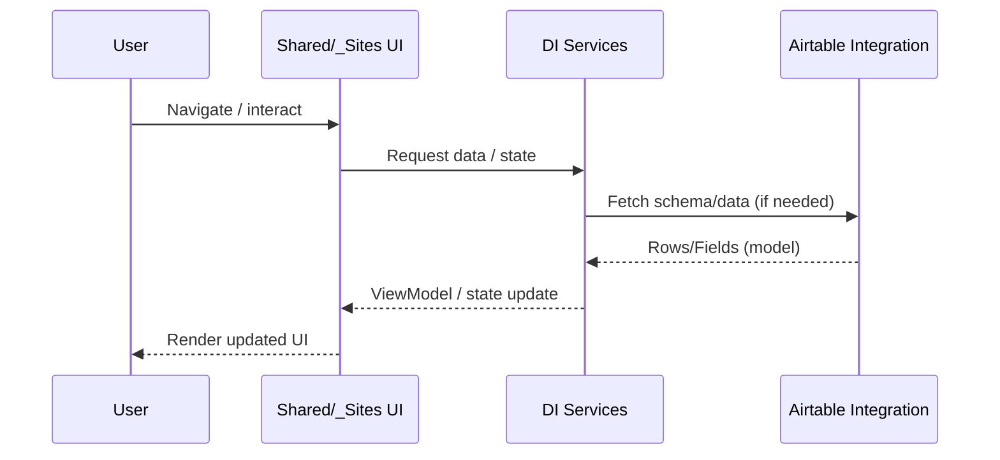

# Data Flows

End-to-end narratives showing how data moves through UI, services, and integrations.

---
## Data flow map

The dominant flow is UI-driven: user interactions in `Shared/_Sites` request state/services, which may fetch from Airtable.

## Caching

Caching strategy is **partially unknown** in this scan.

Investigation steps:
- Search Airtable integration for in-memory caches.
- Search for `MemoryCache` usage.

## State ownership

- UI state: components/services
- Integration data: Airtable integration package

---
- **[Back to rootserver.md](rootserver.md)**
- **[Back to Architecture index](rootserver-12-arch-index.md)**

---
