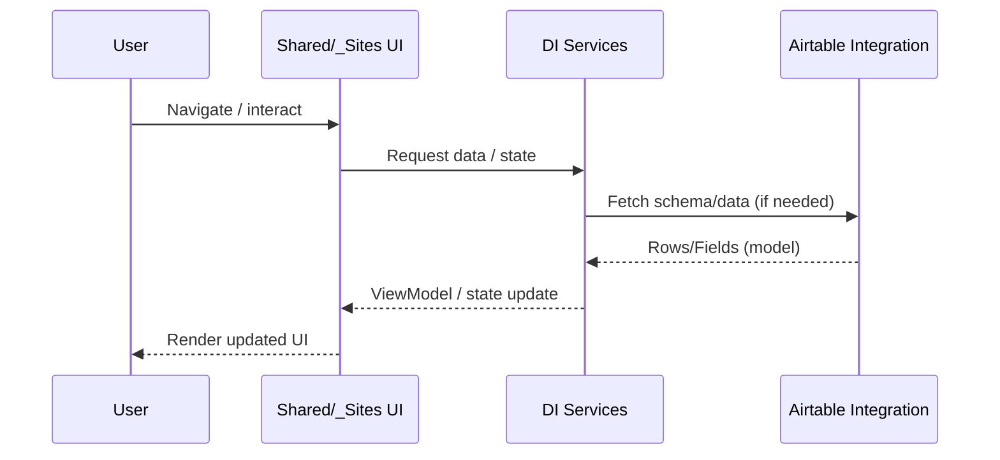
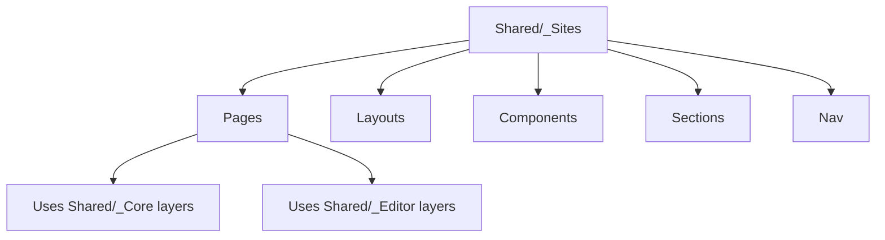

# Diagrams

A consolidated set of diagrams for quick orientation and review.

---
## Diagram index

- System boundaries (flowchart)
- Primary runtime flow (sequence)
- UI hierarchy (flowchart)


## System boundaries

```mermaid
flowchart LR
  subgraph Host[RootServer Host]
    Boot[Program.cs / DI]
    UI[Shared/_Sites UI hierarchy]
    Core[Shared/_Core (00..09)]
    Editor[Shared/_Editor (00..09 + 02_Properties)]
  end

  subgraph Plugins[Plugin-style Integrations]
    Airtable[Shared/Plugins/Airtable]
  end

  Boot --> UI
  UI --> Core
  UI --> Editor
  Boot --> Airtable
  Airtable --> Core
```

## Runtime sequences



## UI hierarchy (if present)



---
- **[Back to rootserver.md](rootserver.md)**
- **[Back to Architecture index](rootserver-12-arch-index.md)**

---
