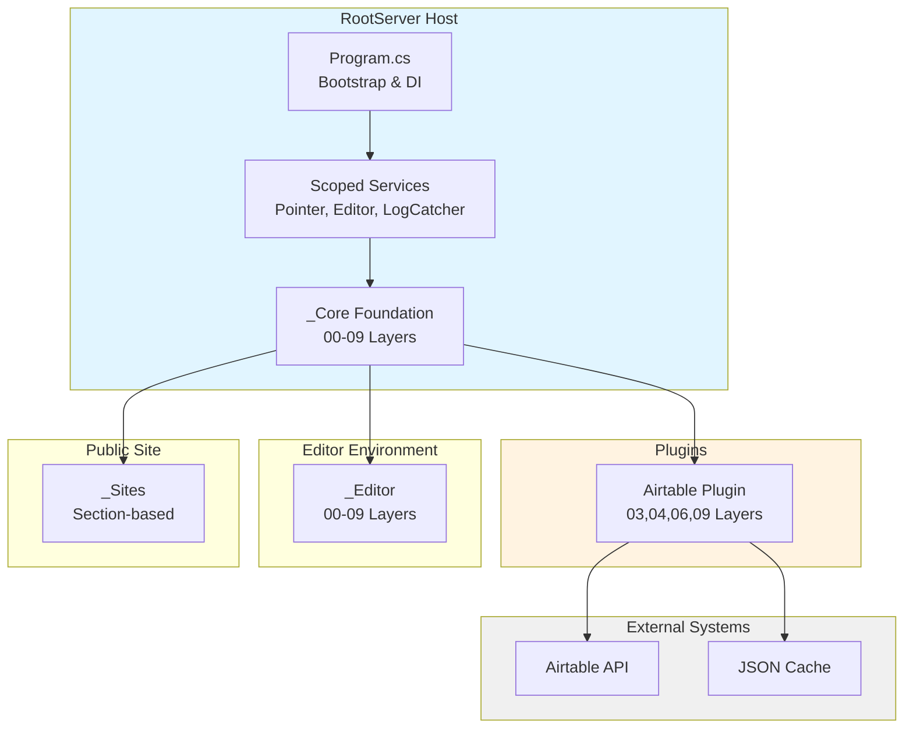

# System Architecture

---

## Overview

RootServer implements a three-tier architecture:

1. **Presentation Layer** - Blazor Server components (schema-driven UI)
2. **Service Layer** - Scoped services for state management
3. **Data Layer** - Airtable API + JSON cache

---

## Boundary Diagram

---

## Key Architectural Decisions

### Schema-Driven Rendering
UI generated from JSON metadata rather than hardcoded layouts. Enables rapid iteration and data-driven customization.

### Service-Based State
State managed through scoped services (Pointer_Service, EditorView_Service) rather than component parameters. Provides centralized control and loose coupling.

### Layer-Based Composition
00-09 folder system enforces micro-to-macro architecture. Lower layers provide primitives; higher layers compose them.

### Plugin Isolation
Plugins implement layer subsets without coupling to host. Host provides extension points but doesn't depend on plugin internals.

---

[← Back to Architecture Index](rootserver-12-arch-index.md)

---
